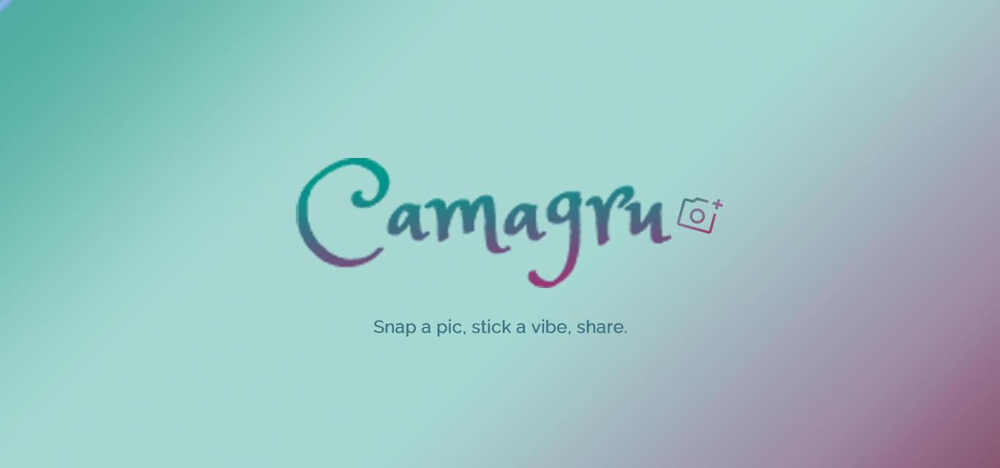

# Camagru



<div align="center">
  <em>  
    This project was created as part of the 42 curriculum by <a href="https://github.com/ysengoku">yusengok</a>.
  </em>
  <br /><br />
  
  
  
</div>

## Table of Contents

<details>
<summary>Click to Show / Hide</summary>

- [About](#about)
- [Objectives](#objectives)
- [Features](#features)
- [Architecture](#architecture)
- [Project Structure](#project-structure)
- [Tech Stack](#tech-stack)
- [Technical Restrictions](#technical-restrictions)
- [Getting Started](#getting-started)
  - [Prerequisites](#prerequisites)
  - [Installation](#installation)
  - [Usage](#usage)
  - [Development Tools](#development-tools)
    - [Linting & Formatting](#linting--formatting)
    - [Static Analysis](#static-analysis)
    - [API documentation](#api-documentation)
    - [Live Development](#live-development)
- [Testing](#testing)
- [Resources](#resources)
- [Authors](#authors)
- [License](#license)

</details>

## About

Camagru is an MVC based photo-editing web app: take a picture with your webcam (or upload one), overlay it with a sticker, add some text and a filter, and share it. Every shared photo lands in a public gallery where other users can like and comment on it.

## Objectives

This project's main objective is to build a custom MVC architecture from scratch, without relying on a framework, while working directly with raw SQL for data persistence.   
It also covers image manipulation: webcam capture, canvas-based editing, coordinate mapping between the preview and the final image, server-side compositing (stickers, text, filters), and storage.

## Features

### User Management

- Account creation with username, email, and password, gated behind email verification before the account becomes active
- Login and session-based authentication with username and password
- One-click logout that immediately clears the session
- Forgot-password flow: request a reset link by email, then set a new password via a time-limited token
- Resend verification/reset email if lost or expired (rate-limited)
- Update profile: username, email (with re-verification), password, avatar, and an email-notification toggle
- Email notifications when someone comments on your posts, with an opt-out in profile settings
- Choose an avatar from your own uploaded posts

### Gallery

- Public gallery of all users' posts with infinite-scroll pagination
- Like and comment on posts when logged in, with live-updating counts
- Download own posts
- Delete own comments

### Studio

- Capture a photo directly from the webcam in the browser
- Compose the shot with stickers, custom text, and filters, previewed live before saving
- Upload a photo from disk instead of capturing one with the webcam
- Final image composed server-side, not client-rendered
- Own post history shown on the studio page
- Delete own posts

### Security

- Passwords hashed, never stored in plain text
- Client-side and server-side validation on every form input and file upload
- Protection against XSS via output escaping
- Protection against SQL injection via prepared statements throughout

### Other

- Automatically generated API documentation from PHPDoc comments in the controllers
- Responsive layout (header, main content, footer) that adapts across screen sizes
- Compatible with Firefox and Google Chrome

## Architecture

Camagru follows a hybrid architecture: a hand-rolled PHP **MVC** framework, built without any external framework or library, renders the server side. Each page is served as a normal, full server render on first load; most then update in place afterward via **AJAX requests** that return HTML fragments.   
The Studio editor is the exception, running as a self-contained client-side application for capture and composition.

See [doc/ARCHITECTURE.md](./doc/ARCHITECTURE.md) and [doc/MVC.md](./doc/MVC.md) for more details.

## Project Structure

```
.
├── app
│   ├── client
│   │   ├── js/
│   │   ├── styles/
│   │   ├── Dockerfile
│   │   ├── package.json
│   │   └── vite.config.js
│   │
│   ├── cron
│   │   ├── cleanup_unverified_users.php
│   │   ├── crontab
│   │   └── Dockerfile
│   │
│   ├── public
│   │   ├── assets/
│   │   └── index.php
│   │
│   ├── src
│   │   ├── Models/
│   │   ├── Views/
│   │   ├── Controllers/
│   │   ├── Services/
│   │   ├── DTO/
│   │   ├── core/
│   │   ├── config/
│   │   ├── helper/
│   │   ├── bootstrap.php
│   │   └── Application.php
│   ├── tests/
│   ├── Dockerfile
│   └── composer.json
│
├── database
│   ├── Dockerfile
│   └── migrations/
│
├── nginx
│   ├── Dockerfile
│   └── nginx*.conf
│
├── docker-compose*.yml
├── Makefile
├── doc/
└── README.md
```

## Tech Stack

**Languages:**   
<div>   
  
  
  
</div>
<br /> 

**Database:**   

<div>
  
</div>
<br />

**Tools:**   
<div>
  
  
  
</div>
<br />

*Composer is used only for development tooling (linting, formatting and Psalm) with no runtime dependencies.*

<br />

**Infrastructure:**   
<div>
  
  
  
  
  
</div>
<br />

**Development Environment:**   
<div>
  
  

  
  
  
</div>


## Technical Restrictions

- Frontend: HTML, CSS, vanilla JavaScript only
- Backend: any language, limited to functions with an equivalent in the PHP standard library
- Containerized deployment: one or more containers, deployable with a single command (Docker Compose or an equivalent)
- Must be free of any security vulnerabilities
- No errors, warnings, or log lines in any console (both server-side and client-side)

## Getting Started

### Prerequisites

- `make`
- `docker`
- MailTrap account, a domain you own and DNS provider (Cloudflare)

### Installation

Clone the repo:
```bash
git clone https://github.com/ysengoku/camagru.git
cd ./camagru
```

Prepare `.env` file (`.env.dev` for development environment):
```bash
cp ./.env.example ./.env

# Then, update the values.
```

> [!NOTE]
> For a real deployment, set `DOMAIN_NAME` and `HOST_IP` in `.env` before building.

### Usage

Build Docker images and start:
```bash
# For production
make

# For development
make dev
```

To access the app in browser, 
- for production: use the URL set as `APP_BASE_URL` in `.env`
- for development: `http://localhost:8080`  *(`getUserMedia()` only treats localhost or HTTPS)*
   
> [!TIP]
> Populate the database with demo data (usable both in production and development):
> ```bash
> make populate-db
>
> # To remove all data from DB
> make clean-db
> ```

### Development Tools

#### Linting & Formatting

This project uses PHPCS/PHPCBF (backend), ESLint/Prettier (frontend) for linting and automatic fixing.

```bash
# Backend
make lint-php
make format-php

# Frontend
make lint-js
make format-js
```

#### Static Analysis

[Psalm](https://psalm.dev) provides static analysis for the PHP backend, catching type errors and other bugs before they reach production.

```bash
make psalm

# Baseline of pre-existing issues is tracked in app/psalm-baseline.xml
```

#### API Documentation

API documentation is generated directly from PHPDoc comments on controller methods, using a custom PHP script, so the docs can't drift out of sync with the actual routes.

```bash
make api-doc
```

#### Live Development

Backend (PHP) code is bind-mounted into the container (`./app:/var/www/html`), and PHP is interpreted per-request rather than compiled, so changes to PHP files apply immediately, no rebuild or restart needed.

Frontend (JS/CSS) needs a build step by design choice of this project, so it works differently: nginx proxies requests to a Vite dev server (`client:5173`) instead of serving pre-built files. After changing JS or CSS, refresh the browser to see the update.

## Testing

This project uses PHPUnit for automated tests, covering validation logic, services, controllers, and cron scripts.   

Tests are organized under `app/tests/`, mirroring `app/src/`, and run inside the `camagru_app` container. Those that need a database run against a separate camagru_test database, truncated between tests so each test starts clean.

```bash
make test-php

# To generate a coverage report:
docker exec camagru_app vendor/bin/phpunit --coverage-text
```

## Resources

- [MVC - Glossary | MDN](https://developer.mozilla.org/en-US/docs/Glossary/MVC)
- [初心者が説明する初心者のためのMVCフレームワーク](https://qiita.com/Keita-0025/items/8cec12c81956dfb61571)
- [PHP Data Objects](https://www.php.net/manual/en/book.pdo.php)
- [Image Processing and GD](https://www.php.net/manual/en/book.image.php)
- [How SMTP uses TCP Sockets for communication ?](https://medium.com/@gurpreetkhanuja2309/how-smtp-uses-tcp-sockets-for-communication-ecfb9f1a3f65)
- [Email API/SMTP | MailTrap](https://docs.mailtrap.io/getting-started/email-api-smtp)
- [Email Sandbox | MailTrap](https://docs.mailtrap.io/getting-started/email-sandbox)

## Authors

<div valign="top">
  
  &nbsp Yuko SENGOKU &nbsp&nbsp (<a href="https://github.com/ysengoku">GitHub @ysengoku</a>)
</div>

## License

This project is for educational purposes.
