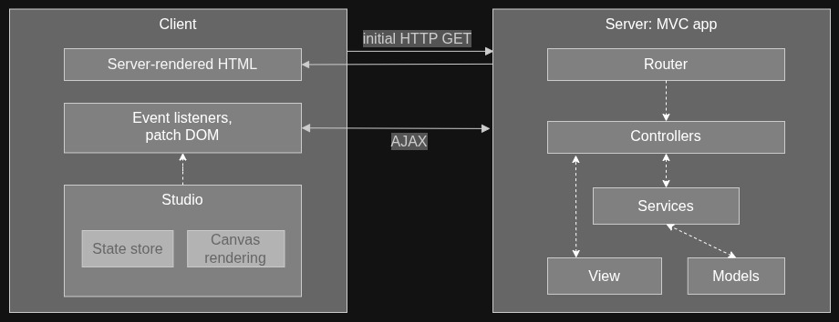
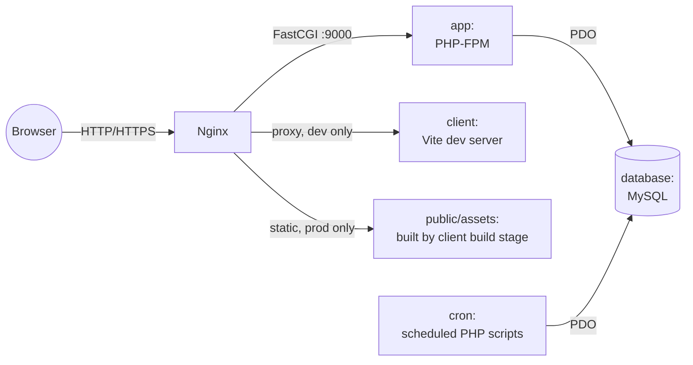
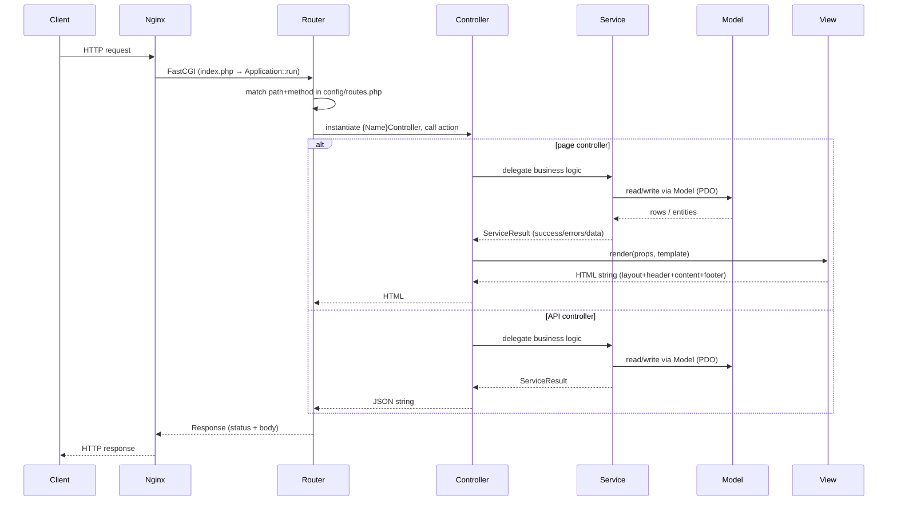

# Architecture

This document describes how Camagru is put together: the server-side AJAX-enhanced MVC application, the Service layer that sits on top of it, and the per-page client-side script that ranges from a few event listeners to a stateful self-contained editor.

The architecture is a hybrid:
- **Server side**: a hand-rolled PHP MVC framework (`app/src/core`) renders full HTML pages. The Router dispatches to a Controller, which orchestrates a **Service layer** (holding business logic, keeping Controllers thin) backed by Models, then renders a View with the result.
- **Client side**: on first load, the browser sends a plain HTTP GET and receives a full server-rendered HTML page. From there, every page attaches event listeners, sends AJAX requests to the same JSON APIs, and patches the DOM with the response. The **Studio** page uses this same mechanism, plus an extra layer: its own state store and canvas rendering for a more app-like editing experience.

 

## Deployment Architectur

Four Docker services form the runtime (a fifth, `cron`, is added in production):

### Nginx

Entry point. Serves `app/public` directly, proxies PHP requests to `app` over FastCGI. In develoment, it proxies `/js`, `/styles`, `/@vite`, `/node_modules` to the Vite dev server for HMR-free live-reload of unbuilt assets. In production, it serves the pre-built `public/assets` directly instead.

### App

PHP-FPM (FastCGI Process Manager) running the MVC application described in the next section [Server-side: MVC + Service layer](#server-side-mvc--service-layer).

### Client

In development, a long-running Vite dev server.   
In production, a one-shot build stage whose `dist` output is copied into `public/assets` and the container then exits.

### Database

MySQL, initialized from `database/migrations`.

### Cron

Production-only container running scheduled maintenance scripts (`app/cron/cleanup_unverified_users.php`) against the same database.

## Server-side: MVC + Service layer

### Request lifecycle

Every request is funneled through `public/index.php` → `Application::run()`.
This is the single front controller; there are no per-route bootstrap files.

`Router::resolve()` does a flat linear match against the route table (path + optional method) — no path parameters, no regex. Every dynamic value (e.g. `token`, `action`) comes from the query string or POST body, not from the URL path itself. This keeps the router trivial at the cost of expressiveness; it is sufficient because the app has a small, fixed set of pages.   

`Controller::run()` dispatches to a public method named after the route's `action`. A single controller class commonly handles multiple HTTP methods for the same page (e.g. `AuthController::login()` switches on `Request::getMethod()` to serve the GET page and handle the POST submission), rather than splitting GET/POST into separate actions.   

### Layer responsibilities

#### **`app/src/core/`** (framework primitives)

| Class | Responsibility |
|---|---|
| `Application` | Front controller: resolves the route, instantiates the controller, sends the `Response`. |
| `Router` | Linear path+method matcher over the static route table. |
| `Controller` (abstract) | Base for all controllers: action dispatch, `render()` (delegates to `View`), `json()`, `methodNotAllowed()`. |
| `Model` (abstract) | ActiveRecord-style base: `findById`/`findOneByField`/`findWithPagination`/`count`, `save()` (insert or update), `delete()`, `validate()`/`beforeSave()` hooks, schema-driven field persistence. |
| `View` | Renders a template file, then composes it into `layout.php` together with `header.php`/`footer.php` via output buffering. No template inheritance system beyond this fixed skeleton. |
| `Request` / `Response` | Static request accessors (query, POST body, files, CSRF token) and a response object holding status/body sent once at the end of `Application::run()`. |
| `SessionStore` | Typed wrapper around `$_SESSION`, keyed by the `SessionKey` enum; owns login/logout session semantics (including session-fixation protection via `session_regenerate_id`). |
| `DatabaseSessionHandler` | Custom `SessionHandlerInterface` implementation that persists sessions to the `sessions` DB table instead of the filesystem, so sessions survive across PHP-FPM workers/containers. |
| `HTTPNotFoundException` | Thrown to short-circuit to a 404 response; caught centrally in `Application::run()`. |
| `HTTPMethodNotAllowedException` | Thrown by `Router::resolve()` when a path matches but the HTTP method doesn't; caught centrally to return a 405. |

#### **`app/src/Controllers/`** (request handlers)

Both `$this->render()` (HTML, full page load) and `$this->json()` (AJAX) appear across controllers. Which one an action uses is determined by the route it serves.

Controllers are intentionally thin: they parse the request, call a Service (or a Model directly for simple reads), and translate the `ServiceResult`/entity into a `render()`/`json()` call. They do not contain validation or persistence logic themselves.

#### **`app/src/Services/`** (business logic)

Added on top of classic MVC to keep Controllers thin where a Service exists, and to give Models a narrow, data-access-only responsibility. Not every controller delegates fully, though. Some have no dedicated Service and hold their business logic directly.

- Each service is a **Singleton** (`SingletonTrait`, private constructor, `getInstance()`), since services are stateless request-scoped orchestrators, not data objects.
- Every mutating operation returns a `ServiceResult` DTO instead of throwing for expected failure cases. Controllers branch on `$result->success` and never need to know which exception types a service might throw.

#### **`app/src/Models/`** (data layer)

`User`, `Post`, `Comment`, and `Like` extend the base `Model` class and follow the ActiveRecord pattern, with no query builder or ORM. Beyond the base CRUD helpers, each model writes its own SQL directly.

#### **`app/src/DTO/`** (Data Transfer Object)

Plain, mostly-readonly data carriers used at layer boundaries: `SignupData`/`PostCommentData`/`PostData` shape controller input before it reaches a Service; `ServiceResult` shapes Service output before it reaches a Controller; `SessionKey` is an enum of typed session keys (avoids stringly-typed `$_SESSION` access).

#### **`app/src/Views/`**

Every page composes through the same skeleton: `layout.php` includes `header.php`, `footer.php`, and the requested template whose path is derived from the controller/action name.

Every full page composes through the same skeleton: `View::render()` buffers `header.php`, `footer.php`, and a template into `layout.php`. The template path defaults to `<controller>/<action>` but may be overridden explicitly.   
AJAX and overlay responses use `renderContent()` instead, skipping the layout entirely.

## Client-side: per-page bundles + interactive modules

Every navigation is a real page load; the server always renders full HTML. The attached JS bundle then makes the page reactive.

Studio stands apart: a genuine client-side application that owns webcam access, canvas drawing, and drag-resize interactions for stickers and text, and only talks to the server once, at the end, posting the final composited state as one JSON payload.

### Build setup

`app/client/vite.config.js` builds **independent entry points**, not one app bundle.

`Views/layout.php` decides at render time which bundles a page loads:   
`main.js` loads global CSS, `api.js`, and `logout.js` on every page.   
Each page also loads a script named after `$props['pageScript']`, which defaults to the lowercased controller name.

### Shared client foundation

- **`api.js`:**   
 Small `fetch` wrapper (`api.get/post/put/delete`) with a fixed `endpoints` map to `/api/*` routes; throws `{status, data}` on non-2xx so callers can branch on server-returned error shapes.
- **`store/State.js`:**   
 a minimal pub/sub store (`setState`/`subscribe`), framework-free. Not global: each page that needs state instantiates its own store.
- **`store/studioStore.js`:**   
 the one instance of `State` in use, holding all Studio editor state (`editorMode`, `selectedStickers`, `textOverlay`, `uploadedImage`, …).
- **`toast.js`:**   
 shared UI feedback for API responses across pages.

## Infrastructure / deployment view

Both dev and prod share `docker-compose.yml` as a base (services: `app`, `client`, `nginx`, `database`) and layer environment-specific overrides.

| Concern | Dev (`docker-compose.dev.yml`) | Prod (`docker-compose.prod.yml`) |
|---|---|---|
| `app` build target | `development` | `production` |
| Client assets | `client` container runs Vite dev server on `:5173`; nginx proxies `/js`, `/styles`, `/@vite`, `/node_modules` to it for live, unbundled ES modules | `client` build stage runs `vite build` once, then its entrypoint copies `dist` into `app/public/assets` and exits; nginx serves those files statically |
| nginx | HTTP only, `:8080` | HTTPS with a self-signed cert, `:8443`; HTTP redirects to HTTPS; adds `X-Content-Type-Options`/`X-Frame-Options`/`X-XSS-Protection` headers |
| Extra services | — | `cron` container running scheduled maintenance (e.g. deleting unverified accounts) against `database` |
| Source mounting | `app/`, `app/client/` bind-mounted for live edit | none |

In both environments, nginx is the only container with a public port; `app` and `database` are only reachable over the internal `camagru_network`. PHP requests reach `app` over FastCGI (`fastcgi_pass camagru_app:9000`); everything else (`/media/`, and in prod `/assets/`) is served by nginx directly from a shared volume, so PHP-FPM never handles static file I/O.
