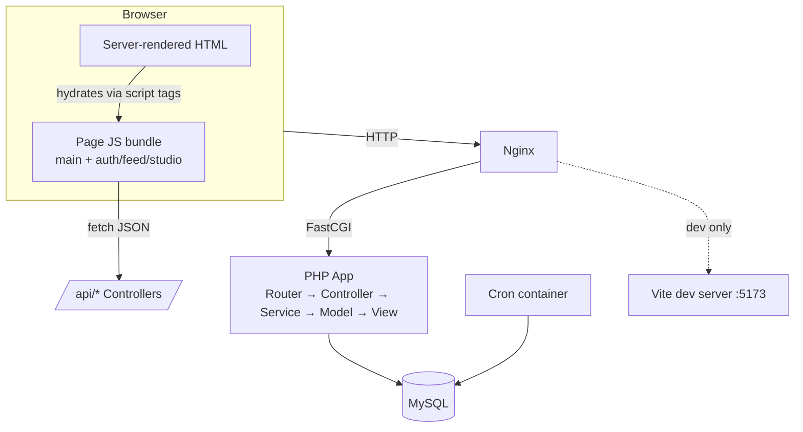
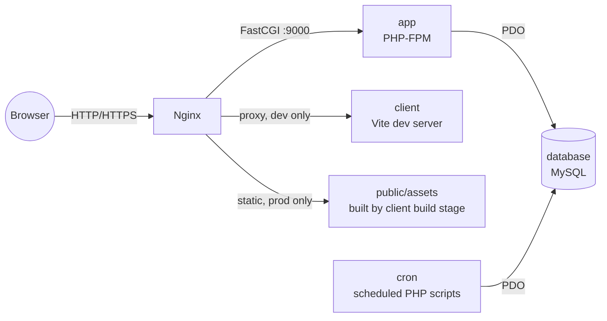
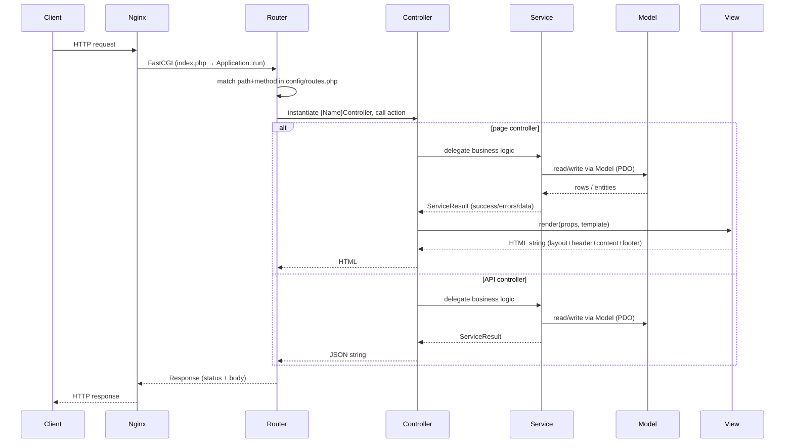

# Architecture

This document describes how Camagru is put together: the server-side MVC application, the Service layer that sits on top of it, and the per-page client-side code that ranges from a few event listeners to a small SPA-like editor.

## 1. Overview

Camagru is a photo-sharing app where users capture or upload a photo, decorate it with stickers, text and filters in a browser-based studio, and post it to a feed.

The architecture is a hybrid:

- **Server side**: a hand-rolled PHP MVC framework (`app/src/core`) renders full HTML pages, with a **Service layer** inserted between Controllers and Models to hold business logic and keep Controllers thin.
- **Client side**: not a single-page application. Each page is a normal server-rendered HTML document that loads a page-specific JavaScript bundle. Most pages (`auth`, `feed`) only attach event listeners and call JSON APIs. The **Studio** page is the exception — it behaves like a self-contained client-side app with its own state store, managers, and canvas rendering, layered on top of the same server-rendered shell.



## 2. High-level architecture diagram

Four Docker services form the runtime (a fifth, `cron`, is added in production):



### Nginx

Entry point. Serves `app/public` directly, proxies PHP requests to `app` over FastCGI, and (in dev) proxies `/js`, `/styles`, `/@vite`, `/node_modules` to the Vite dev server for HMR-free live-reload of unbuilt assets. In prod it serves the pre-built `public/assets` directly instead.

### App

PHP-FPM running the MVC application described in section 3.

### Client

In dev, a long-running Vite dev server.   
In prod, a one-shot build stage whose `dist` output is copied into `public/assets` and the container then exits.

### Database**

MySQL, initialized from `database/migrations`.

### Cron

Prod-only container running scheduled maintenance scripts (e.g. `app/cron/cleanup_unverified_users.php`) against the same database.

## 3. Server-side: MVC + Service layer

### 3.1 Request lifecycle

Every request is funneled through `public/index.php` → `Application::run()`.
There is a single front controller, no per-route bootstrap file.



`Router::resolve()` does a flat linear match against the route table (path + optional method) — no path parameters, no regex. Every dynamic value (e.g. `token`, `action`) comes from the query string or POST body, not from the URL path itself. This keeps the router trivial at the cost of expressiveness; it is sufficient because the app has a small, fixed set of pages.   

`Controller::run()` dispatches to a public method named after the route's `action`. A single controller class commonly handles multiple HTTP methods for the same page (e.g. `AuthController::login()` switches on `Request::getMethod()` to serve the GET page and handle the POST submission), rather than splitting GET/POST into separate actions.   

### 3.2 Layer responsibilities

#### **`app/src/core/` — framework primitives**

| Class | Responsibility |
|---|---|
| `Application` | Front controller: resolves the route, instantiates the controller, sends the `Response`. |
| `Router` | Linear path+method matcher over the static route table. |
| `Controller` (abstract) | Base for all controllers: action dispatch, `render()` (delegates to `View`), `json()`, `methodNotAllowed()`. |
| `Model` (abstract) | ActiveRecord-style base: `findById`/`findOneByField`/`findAll`, `save()` (insert or update), `delete()`, `validate()`/`beforeSave()` hooks, schema-driven field persistence. |
| `View` | Renders a template file, then composes it into `layout.php` together with `header.php`/`footer.php` via output buffering. No template inheritance system beyond this fixed skeleton. |
| `Request` / `Response` | Static request accessors (query, POST body — JSON or form —, files, CSRF token) and a response object holding status/body sent once at the end of `Application::run()`. |
| `SessionStore` | Typed wrapper around `$_SESSION`, keyed by the `SessionKey` enum; owns login/logout session semantics (including session-fixation protection via `session_regenerate_id`). |
| `SessionHandler` | Custom `SessionHandlerInterface` implementation that persists sessions to the `sessions` DB table instead of the filesystem, so sessions survive across PHP-FPM workers/containers. |
| `HTTPNotFoundException` | Thrown to short-circuit to a 404 response; caught centrally in `Application::run()`. |

#### **`app/src/Controllers/` — request handlers**

Two flavors, distinguished by return type and location:

- Page controllers (`AuthController`, `FeedController`, `ProfileController`, `StudioController`) return HTML via `$this->render()` for GET page loads, and JSON via `$this->json()` for the POST/PATCH form-submission endpoints on the same route prefix.
- `Controllers/API/*` (`PhotoApiController`, `StudioConfigController`, `ValidationRulesController`) are JSON-only endpoints consumed by page JS (photo save, studio config, shared validation rules). They never call `render()`.

Controllers are intentionally thin: they parse the request, call a Service (or a Model directly for simple reads), and translate the `ServiceResult`/entity into a `render()`/`json()` call. They do not contain validation or persistence logic themselves.

#### **`app/src/Services/` — business logic**

Added on top of classic MVC specifically to keep Controllers free of business rules and to give Models a narrow, persistence-only responsibility. Conventions:

- Each service is a **Singleton** (`SingletonTrait`, private constructor, `getInstance()`), since services are stateless request-scoped orchestrators, not data objects.
- Every mutating operation returns a `ServiceResult` DTO (`success: bool`, `errors: array`, `data: mixed`) instead of throwing for expected failure cases (validation errors, "already taken", etc.). Controllers branch on `$result->success` and never need to know which exception types a service might throw.
- `Services/auth/*` (`SignupService`, `LoginService`, `ForgotPasswordService`, `ResetPasswordService`, `AuthInputValidator`) hold the multi-step auth flows (validate → check availability → create/update → send email → set session).
- `ImageComposer` is a non-singleton, stateful service scoped to a single compose operation: constructed with the base64 webcam/upload image, it applies filters (via `imagefilter`), stickers, and TrueType text overlays (via `imagefttext`) onto a GD canvas and writes the result to `public/media`.
- `EmailService` sends transactional email (verification, password reset), rendered from `Views/emails/*` templates via `renderEmailTemplate()`.

#### **`app/src/Models/` — persistence**

`User`, `Post`, `Comment`, `Like` extend the base `Model`. They are ActiveRecord-style: schema is declared as a static `$schema` array, rows hydrate into instances via `fromRow()`, and `save()` inserts or updates based on whether `id` is set. Query building is minimal/manual (no query builder or ORM relations beyond the declared `$relations` metadata) — each model writes its own SQL for anything beyond the base CRUD helpers.

#### **`app/src/DTO/`**

Plain, mostly-readonly data carriers used at layer boundaries: `SignupData`/`PostCommentData`/`PostData` shape controller input before it reaches a Service; `ServiceResult` shapes Service output before it reaches a Controller; `SessionKey` is an enum of typed session keys (avoids stringly-typed `$_SESSION` access).

#### **`app/src/Views/`**

Every page composes through the same skeleton: `layout.php` includes `header.php`, the requested `{controller}/{action}.php` template (`Controller::render()` derives this path from the controller/action name), and `footer.php`. Reusable fragments live under `Views/components/` (e.g. `avatar.php`, `icon.php`) and are `include`d directly — there is no component/props system beyond plain PHP function/include calls. Feed and Studio have their own `Views/feed/*` and `Views/studio/*` subtrees for page-specific partials (post cards, comment forms, studio tool panels).

## 4. Client-side: per-page bundles + SPA-like modules

### 4.1 Build setup

`app/client/vite.config.js` builds **four independent entry points**, not one app bundle:

```js
input: {
  main:   './js/main.js',
  studio: './js/studio/entry.js',
  feed:   './js/feed/entry.js',
  auth:   './js/auth/entry.js',
}
```

`Views/layout.php` decides at render time which bundles a page loads:

- `main.js` (global CSS import + `api.js` + `logout.js`) is loaded on **every** page.
- The page-specific bundle is loaded only if the controller sets `$props['pageScript']` — which `Controller::render()` defaults to the lowercased controller name, so `StudioController` → `studio.js`, `FeedController` → `feed.js`, `AuthController` → `auth.js`. `ProfileController`/others with no matching entry simply load nothing beyond `main.js`.
- Dev vs. prod is a runtime branch in `layout.php`: dev serves unbundled ESM straight from the Vite dev server (`/js/main.js`, `/js/{page}/entry.js`, proxied by nginx), prod serves the built, hashed files from `/assets/`.

This is the mechanism tying the server's routing/controller naming directly to which client code gets loaded — there is no client-side router.

### 4.2 The "MPA + partial SPA" design

Every navigation is a real page load; the server always renders full HTML. What varies by page is how much the attached JS bundle does after that HTML lands:

- **auth**, **feed**: mostly event listeners bound to existing DOM — form submit → `api.js` call → toast/redirect (`auth/login.js`, `auth/signup.js`, …), or small in-place DOM updates (`feed/feedManager.js`, `post/comments.js` for likes/comments without a full reload).
- **studio**: a genuine client-side application. It owns webcam access, canvas drawing, drag/resize interactions for stickers and text, and only talks to the server once, at the end, POSTing the final composited state (base image, stickers, text overlay, filter) as one JSON payload to `/api/photos`, where `PhotoApiController::create()` hands it to `ImageComposer` (section 3.2) to rasterize the final JPEG and persist a `Post`. It is the one place in the client codebase that looks like a real SPA rather than progressive enhancement. Its internal structure (state store, managers) is documented separately in a Studio-specific doc.

### 4.3 Shared client foundation

- **`api.js`** — a small `fetch` wrapper (`api.get/post/put/delete`) with a fixed `endpoints` map to `/api/*` routes; throws `{status, data}` on non-2xx so callers can branch on server-returned error shapes (the same shape as `ServiceResult.errors`).
- **`store/State.js`** — a minimal pub/sub store (`setState`/`subscribe`), framework-free. Not global: each page that needs state instantiates its own store.
- **`store/studioStore.js`** — the one instance of `State` in use, holding all Studio editor state (`editorMode`, `selectedStickers`, `textOverlay`, `uploadedImage`, …).
- **`toast.js`** — shared UI feedback for API responses across pages.

## 5. Infrastructure / deployment view

Both dev and prod share `docker-compose.yml` as a base (services: `app`, `client`, `nginx`, `database`) and layer environment-specific overrides.

| Concern | Dev (`docker-compose.dev.yml`) | Prod (`docker-compose.prod.yml`) |
|---|---|---|
| `app` build target | `development` | `production` |
| Client assets | `client` container runs Vite dev server on `:5173`; nginx proxies `/js`, `/styles`, `/@vite`, `/node_modules` to it for live, unbundled ES modules | `client` build stage runs `vite build` once, then its entrypoint copies `dist` into `app/public/assets` and exits; nginx serves those files statically |
| nginx | HTTP only, `:8080` | HTTPS with a self-signed cert, `:8443`; HTTP redirects to HTTPS; adds `X-Content-Type-Options`/`X-Frame-Options`/`X-XSS-Protection` headers |
| Extra services | — | `cron` container running scheduled maintenance (e.g. deleting unverified accounts) against `database` |
| Source mounting | `app/`, `app/client/` bind-mounted for live edit | none — code is baked into the image at build time |

In both environments, nginx is the only container with a public port; `app` and `database` are only reachable over the internal `camagru_network`. PHP requests reach `app` over FastCGI (`fastcgi_pass camagru_app:9000`); everything else (`/media/`, and in prod `/assets/`) is served by nginx directly from a shared volume, so PHP-FPM never handles static file I/O.

## 6. Directory-to-layer mapping

| Path | Layer |
|---|---|
| `app/public/index.php` | Front controller entry point |
| `app/src/Application.php`, `app/src/core/` | Framework core (Router, base Controller/Model, View, Request/Response, Session) |
| `app/src/config/` | Route table, Studio config, validation rules (shared with client via API) |
| `app/src/Controllers/` | Page controllers (HTML + form-submit JSON) |
| `app/src/Controllers/API/` | JSON-only API controllers |
| `app/src/Services/` | Business logic layer (Singletons, `ServiceResult`) |
| `app/src/Models/` | Persistence layer (ActiveRecord-style) |
| `app/src/DTO/` | Cross-layer data shapes |
| `app/src/Views/` | PHP templates (layout/header/footer + page/component partials) |
| `app/src/helper/` | Free functions used by core/Views (`renderer.php`, `token.php`, `Path.php`) |
| `app/cron/` | Scheduled maintenance scripts (prod-only container) |
| `app/client/js/main.js`, `auth/`, `feed/` | Progressive-enhancement client code (thin) |
| `app/client/js/studio/`, `store/` | SPA-like Studio module + shared state store |
| `app/client/js/api.js` | Client-side API gateway (`fetch` wrapper + endpoint map) |
| `database/migrations/` | Schema source of truth |
| `nginx/`, `docker-compose*.yml` | Deployment/infrastructure topology |
