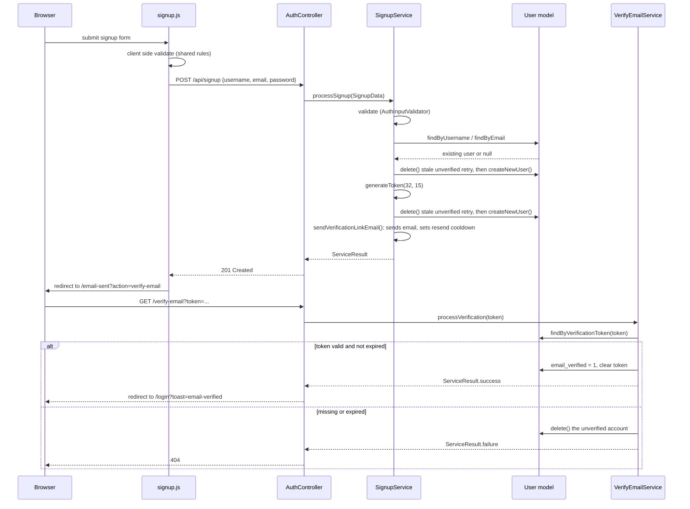
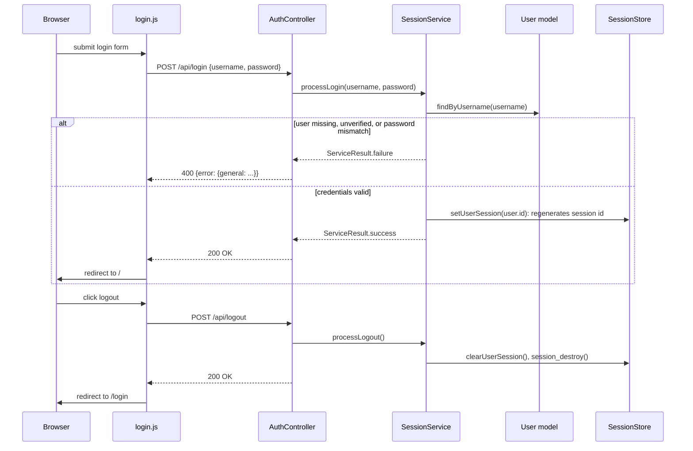
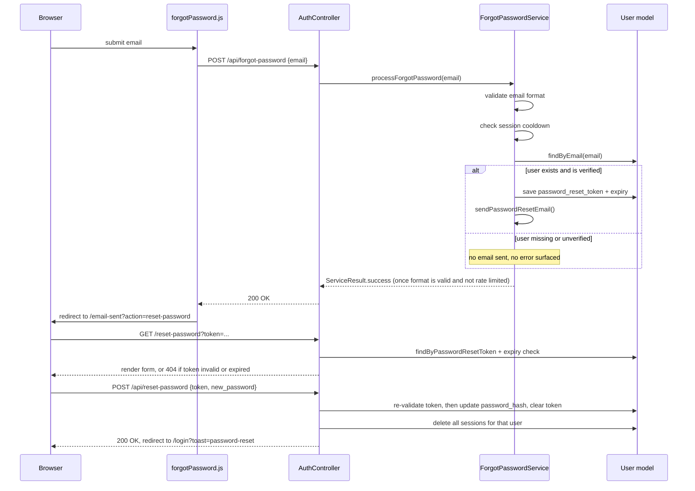

# Authentication & Account Flows

This document describes how authentication flows work in Camagru, the client/server call sequence for each flow, and the session mechanism they all share.   
It complements [`ARCHITECTURE.md`](./ARCHITECTURE.md), which covers the MVC/Service layering these flows are built on, and [`SECURITY.md`](./SECURITY.md), which covers CSRF protection and other cross-cutting security measures that apply to these routes but are not specific to them.

## Overview

Auth covers four user-facing flows, all entered through a single `AuthController`:

| Flow | Entry points | Service |
|---|---|---|
| Signup + email verification | `GET/POST /signup` `GET /verify-email` | `SignupService` |
| Login / logout | `GET/POST /login` `POST /api/logout` | `SessionService` |
| Forgot / reset password | `GET/POST /forgot-password` `GET/POST /reset-password` | `ForgotPasswordService` `ResetPasswordService` |
| Resend email | `POST /api/resend-email` | reuses `SignupService`/`ForgotPasswordService` |

Relevant paths:

- `app/src/Controllers/AuthController.php`: the single controller for every route above.
- `app/src/Services/auth/`: business logic for each flow, one singleton service per flow, and a shared `AuthInputValidator` for input rules.
- `app/src/core/SessionStore.php`: typed wrapper around PHP's native `$_SESSION`.
- `app/src/DTO/`: shared value type definitions.
- `app/client/js/auth/`: one JS module per page.
- `app/cron/cleanup_unverified_users.php`: deletes abandoned unverified accounts (production only).

## Relationship to the MVC + Service architecture

Auth follows the same layering as the rest of the app (see [`ARCHITECTURE.md`](./ARCHITECTURE.md#server-side-mvc--service-layer)): one controller fanning out to several singleton services, each concrete flow shown as a sequence diagram below.

Every service method returns a `ServiceResult` (`success`, `errors`, `data`); `AuthController` only branches on `$result->success` and never inspects exception types. Input crossing from the controller into a service is wrapped in a DTO (`SignupData`) rather than passed as a raw array.

## Session foundation

Sessions are stored in the database: `app/src/core/DatabaseSessionHandler.php` implements `SessionHandlerInterface` and stores session data in the `sessions` table. `app/src/bootstrap.php` registers `DatabaseSessionHandler` before starting the session.   

This applies to every visitor, not just logged in users: signup and forgot password flows store `PendingEmail`, `ResendEmailAction`, and `LastEmailSentTime` (see [Resend email flow](#resend-email-flow)) in the session before any `UserId` exists, so `sessions.user_id` is nullable for exactly this case.

### `SessionStore`
`SessionStore` is a typed wrapper around `$_SESSION`, keyed by the `SessionKey` enum instead of raw string keys.   

- `SessionStore::setUserSession(int $userId)` logs the user in and regenerates the session id.
- `SessionStore::activeSession()` is the login check used across `AuthController`.
- `SessionStore::clearUserSession()` is called on logout alongside `session_destroy()`.

## Signup & email verification flow

Notes on `SignupService::processSignup()`:

1. Validation, then availability checks in `checkAvailability()`: a username is rejected if taken, unless it belongs to the same still unverified signup attempt. This lets a user retry a signup that never got verified. An email is rejected only if it belongs to an already verified account.
2. `createUser()` deletes any stale unverified account for that email or username before inserting the new one, so retries do not collide on the `UNIQUE` constraints in `users`.
3. The verification token is generated with `bin2hex(random_bytes(32))` and expires after 15 minutes. `app/src/helper/mailer.php` builds the link, then sends it via `EmailService`.
4. On success, `PendingEmail` and `ResendEmailAction` are written to the session so `/email-sent` and the resend button know which email and action they are acting on.

`AuthController::verifyEmail()` looks the token up via `User::findByVerificationToken()`, checks `email_verification_token_expires_at` against the current time, and on expiry deletes the account outright (forcing the user to sign up again) rather than just clearing the token.

## Resend email flow

`POST /api/resend-email` is shared by both the verification and reset password flows. It does not take the email or action as input: it reads `SessionKey::PendingEmail` and `SessionKey::ResendEmailAction` from the session set by the signup or forgot password step, so the endpoint cannot be pointed at an arbitrary account.

- A sixty-second cooldown is enforced on the server, returning `429 Too Many Requests` with `time_remaining` while active.
- `resendEmail.js` mirrors the same cooldown on the client (disables the button, counts down), and re-arms the timer from the `429` response if the user's local clock drifts.
- Depending on `ResendEmailAction`, the controller re-validates the still relevant token (the verification token must not be expired or missing for `signup`/`email_change`; the email must already be verified for `reset_password`) before resending.

## Login / logout flow

`SessionService::processLogin()` checks username, email verification, and password together and returns a generic invalid-credentials message on any failure. This matches the enumeration guard used elsewhere in auth: the response stays identical regardless of what actually failed, so it doesn't leak which accounts exist.

Both the GET `/login` and GET `/signup` pages redirect to `/` immediately if `SessionStore::activeSession()` is already true, and their POST handlers reject with `400 Already logged in` under the same condition.

## Forgot password / reset password flow

`ForgotPasswordService::processForgotPassword()` always returns `ServiceResult::success()` once the email format is valid and the cooldown has passed, regardless of whether an account exists or is verified. This is a deliberate anti-enumeration measure: the client cannot distinguish an email that was sent from an email that has no matching account, from the response alone. The same sixty-second session cooldown applies here, so repeated submissions cannot be used to probe accounts either.

`ResetPasswordService::validateToken()` is called twice in the flow:
- once directly by `AuthController::resetPassword()`'s GET handler, to decide whether to render the form or return 404,
- again internally at the top of `processResetPassword()` before the POST actually mutates the password. 
The GET check is a convenience, not a substitute for re-checking at write time.   
On a successful reset, `processResetPassword()` clears the token and expiry, then deletes all sessions for that user, so a stolen session cannot outlive a password change.

## Shared validation rules

Username, email, and password constraints are defined once, on the server, in `app/src/config/validation.php`, and used two ways.

### Server:

`AuthInputValidator` loads this file directly and is the authority. It is what actually runs in `SignupService`, `ForgotPasswordService`, and `ResetPasswordService` before anything is persisted.

### Client: 

`GET /api/validation-rules` serves the same file as JSON.   
The client fetches it once at module load and feeds the `Validator` class, which every auth form uses for pre-submit validation.

Client side validation here is purely a UX optimization: instant feedback, fewer round trips. It is not a security boundary. Server's `AuthInputValidator` validates everything on the server regardless of what the client already checked.
