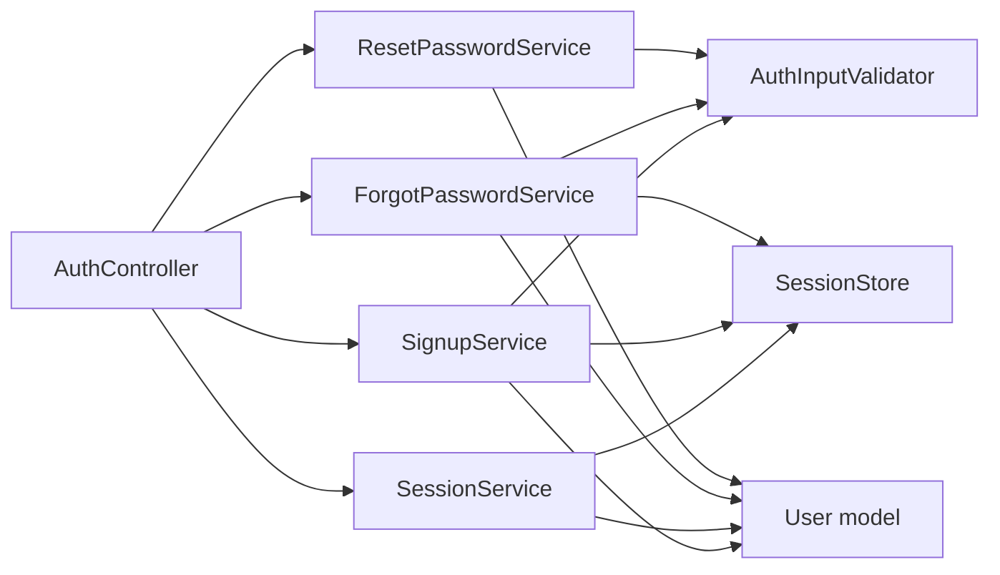
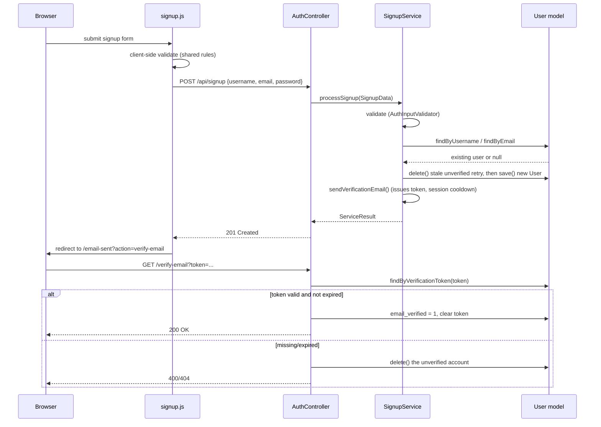
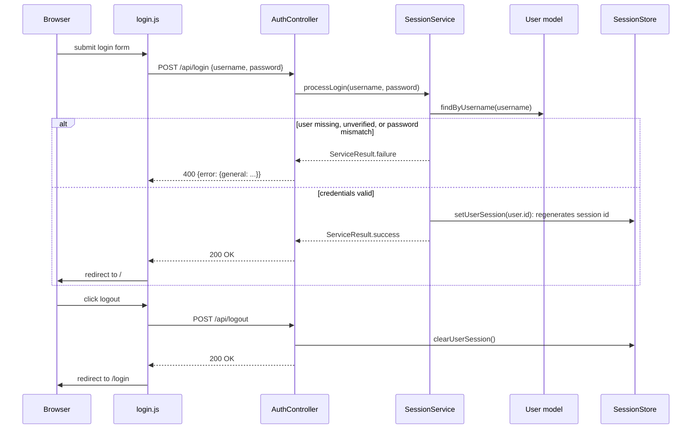
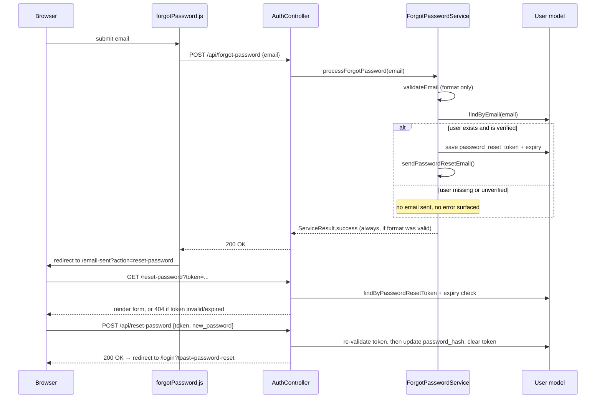

# Authentication & Account Flows

This document describes how signup, email verification, login/logout, and password reset work in Camagru, the client/server call sequence for each flow, and the session mechanism they all share. It complements [`ARCHITECTURE.md`](./ARCHITECTURE.md), which covers the MVC/Service layering these flows are built on.

## 1. Overview

Auth covers four user-facing flows, all entered through a single `AuthController`:

| Flow | Entry points | Service |
|---|---|---|
| Signup + email verification | `GET/POST /signup`, `GET /verify-email` | `SignupService` |
| Login / logout | `GET/POST /login`, `POST /api/logout` | `SessionService` |
| Forgot / reset password | `GET/POST /forgot-password`, `GET/POST /reset-password` | `ForgotPasswordService`, `ResetPasswordService` |
| Resend email (shared) | `POST /api/resend-email` | reuses `SignupService`/`ForgotPasswordService` |

Relevant paths:

- `app/src/Controllers/AuthController.php`: the single controller for every route above.
- `app/src/Services/auth/`: `SignupService`, `SessionService`, `ForgotPasswordService`, `ResetPasswordService`, `AuthInputValidator`.
- `app/src/core/SessionStore.php`: typed wrapper around PHP's native `$_SESSION`.
- `app/src/DTO/SignupData.php`, `ServiceResult.php`, `SessionKey.php`: shared value types definition.（Data Transfer Object）
- `app/client/js/auth/`: one JS module per page (`signup.js`, `login.js`, `forgotPassword.js`, `resetPassword.js`, `resendEmail.js`, `logout.js`) plus shared `helpers/validator.js` and `helpers/validationRules.js`.
- `app/cron/cleanup_unverified_users.php`: deletes abandoned unverified accounts (prod `cron` container).

## 2. Relationship to the MVC + Service architecture

Auth follows the same layering as the rest of the app (see `ARCHITECTURE.md` §3), with one controller fanning out to several singleton services:

Every service method returns a `ServiceResult` (`success`, `errors`, `data`); `AuthController` only branches on `$result->success` and never inspects exception types. Input crossing from the controller into a service is wrapped in a DTO (`SignupData`) rather than passed as a raw array.

## 3. Session foundation

Sessions are DB-backed: `app/src/core/DatabaseSessionHandler.php` implements `SessionHandlerInterface` and stores session data in the `sessions` table. `bootstrap.php` wires it in with `session_set_save_handler(new DatabaseSessionHandler(), true)` before `session_start()`. This applies to every visitor, not just logged-in users: signup/forgot-password flows store `PendingEmail`/`ResendEmailAction`/`LastEmailSentTime` (§5) in the session before any `UserId` exists, `sessions.user_id` is nullable for exactly this case.

- `SessionStore` is a typed wrapper around `$_SESSION`, keyed by the `SessionKey` enum (`UserId`, `PendingEmail`, `ResendEmailAction`, `LastEmailSentTime`) instead of raw string keys.
- `SessionStore::setUserSession(int $userId)` is the single place a user becomes "logged in": it calls `session_regenerate_id(true)` before storing `UserId`, so a pre-login session ID can never remain valid post-login (session fixation protection). It does not clear `PendingEmail`/`ResendEmailAction`/`LastEmailSentTime` — harmless leftovers, not sensitive data.
- `SessionStore::activeSession()` is the login-check used across `AuthController`. `SessionService::processLogout()` calls `SessionStore::clearUserSession()` *and* `session_destroy()`, so the DB row is removed immediately rather than waiting on GC.

## 4. Signup & email verification flow

Notes on `SignupService::processSignup()` (`app/src/Services/auth/SignupService.php`):

- Validation, then availability checks in `checkAvailability()`: a username is rejected if taken, *unless* it belongs to the same still-unverified signup attempt (`existingByUsername->email === $this->userData->email && !email_verified`): this lets a user retry a signup that never got verified. An email is rejected only if it belongs to an already-*verified* account.
- `createUser()` deletes any stale unverified account for that email/username before inserting the new one, so retries don't collide on the `UNIQUE` constraints in `users`.
- `sendVerificationEmail()` builds the verification link from `$_SERVER['HTTP_HOST']` and a token from `generateToken(32)` (`app/src/helper/token.php`, `bin2hex(random_bytes(32))`, default 60-minute expiry). The actual `EmailService::getInstance()->send(...)` call is currently commented out (see §9): only the cooldown timestamp is recorded.
- On success, `PendingEmail` and `ResendEmailAction` are written to the session so `/email-sent` and the resend button (§5) know which email/action they're acting on.

`AuthController::verifyEmail()` looks the token up directly via `User::findByVerificationToken()`, checks `verification_token_expires_at` against the current time, and on expiry deletes the account outright (forcing the user to sign up again) rather than just clearing the token.

## 5. Resend email flow

`POST /api/resend-email` (`AuthController::resendEmail()`) is shared by both the verification and reset-password flows. It doesn't take the email/action as input: it reads `SessionKey::PendingEmail` and `SessionKey::ResendEmailAction` from the session set by the signup or forgot-password step, so the endpoint can't be pointed at an arbitrary account.

- A 60-second cooldown is enforced server-side by comparing `SessionKey::LastEmailSentTime` to `time()`, returning `429 Too Many Requests` with `time_remaining` while active.
- `resendEmail.js` mirrors the same cooldown client-side (disables the button, counts down) using `data-cooldown-remaining` rendered server-side into `Views/auth/emailSent.php`, and re-arms the timer from the `429` response's `remainingTime` if the user's local clock drifts.
- Depending on `ResendEmailAction`, the controller re-validates the still-relevant token (verification token for `verify`, i.e. it must not be expired/missing; email must be verified already for `reset_password`) before delegating back to `SignupService::sendVerificationEmail()` or `ForgotPasswordService::sendPasswordResetEmail()`.

## 6. Login / logout flow

`SessionService::processLogin()` deliberately checks `isEmailVerified()` *before* `password_verify()`, so an unverified account gets a distinct "please verify your email" message rather than a generic invalid-credentials error: the tradeoff is that this also confirms an unverified account with that username exists (there is no equivalent enumeration guard here as there is for forgot-password, §7).

Both the GET `/login` and GET `/signup` pages redirect to `/` immediately if `SessionStore::activeSession()` is already true, and their POST handlers reject with `400 Already logged in` under the same condition.

## 7. Forgot password / reset password flow

`ForgotPasswordService::processForgotPassword()` always returns `ServiceResult::success()` once the email *format* is valid, regardless of whether an account exists or is verified: this is a deliberate anti-enumeration measure (see the comment in `app/src/Services/auth/ForgotPasswordService.php:16`): the client can't distinguish "email sent" from "no such account" from the response alone.

`ResetPasswordService::validateToken()` is called twice in the flow: once directly by `AuthController::resetPassword()`'s GET handler (to decide whether to render the form or 404), and again internally at the top of `processResetPassword()` before the POST actually mutates the password: the GET check is a UX nicety, not a substitute for re-checking at write time.

## 8. Shared validation rules

Username/email/password constraints are defined once, server-side, in `app/src/config/validation.php`, and used two ways:

- **Server**: `AuthInputValidator` (`app/src/Services/auth/AuthInputValidator.php`) loads this file directly and is the authority: it's what actually runs in `SignupService`/`ForgotPasswordService`/`ResetPasswordService` before anything is persisted.
- **Client**: `GET /api/validation-rules` (`ValidationRulesController`) serves the same file as JSON. `auth/helpers/validationRules.js` fetches it once at module load and feeds `auth/helpers/validator.js`'s `Validator` class, which every auth form (`signup.js`, `forgotPassword.js`, `resetPassword.js`) uses for pre-submit validation. If the fetch fails, `validationRules.js` falls back to a hardcoded copy of the same rules so the form doesn't lose validation entirely: but that fallback can silently drift from `config/validation.php` since nothing keeps the two in sync.

Client-side validation here is purely a UX optimization (instant feedback, fewer round trips); it is not a security boundary: `AuthInputValidator` re-validates everything server-side regardless of what the client already checked.

## 9. Planned work (TODO)

The following are known gaps in the current implementation, tracked in `TODO.md`:

- **CSRF protection**: `Request::getCsrfToken()` exists but nothing issues or verifies a token yet. Plan: generate and store a token in `$_SESSION` on first use, render it as `<meta name="csrf-token">` in `layout.php`, have `api.js` attach it as an `X-CSRF-Token` header on every request, and check it with `hash_equals()` in `Application::run()` for POST/PUT/DELETE/PATCH: rejecting mismatches with a new `HTTPForbiddenException` (mirroring `HTTPNotFoundException`) and a 403 response.
- **Session cookie hardening**: `session.cookie_httponly`, `session.cookie_samesite`, and (in prod) `session.cookie_secure` are not currently set.
- **Password-reset hardening**: invalidate the reset token immediately after a successful reset (already niled out on use, but not proactively on any subsequent failed attempt), and rate-limit `/api/forgot-password` itself the same way `/api/resend-email` is rate-limited. Invalidating a user's *other* active sessions on password change is no longer a simple query now that sessions are file-based rather than DB-backed: it would need its own mechanism (e.g. a `password_changed_at` column on `users`, checked against a timestamp stored in the session on each request).
- **`ProfileController`**: `index`/`update` are still stubs (`app/src/Controllers/ProfileController.php`). Planned: `edit` (username/email change, re-verifying on email change; password change) and `settings` (toggling `email_notifications_enabled`).
- **Enable outgoing email**: `EmailService::getInstance()->send(...)` is implemented but commented out in both `SignupService::sendVerificationEmail()` and `ForgotPasswordService::sendPasswordResetEmail()`. Plan: confirm SMTP env vars (`SMTP_HOST`, `SMTP_PORT`, `SMTP_USER`, `SMTP_PASS`, `MAIL_FROM`) are wired for the target environment and uncomment the calls.
