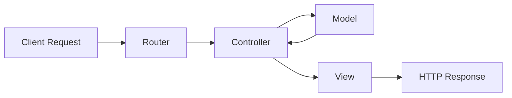

# MVC Guide

This note summarizes the Model–View–Controller pattern in a framework-agnostic way.

## Purpose

- Separate application responsibilities into three layers.
- Keep request handling, business rules, and presentation independent.

## The three layers

- **Model** — owns data and business rules, usually by reading and writing persistent storage.
- **View** — turns data into UI, usually HTML, JSON, or another presentation format.
- **Controller** — receives a request, coordinates models, and selects a response view or payload.

## Typical flow

1. A request enters the application.
2. A controller is chosen to handle it.
3. The controller asks models for the data it needs.
4. The controller passes data to a view or returns a response directly.
5. The response is sent back to the client.

## Flow diagram (Mermaid)

